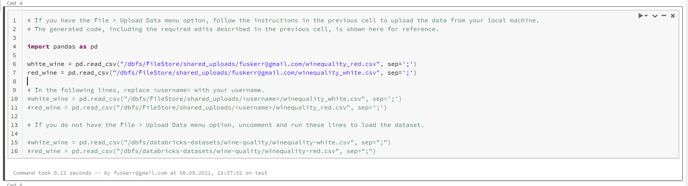
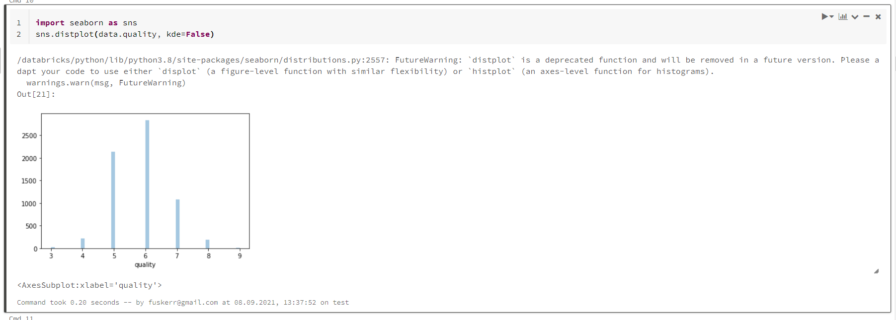
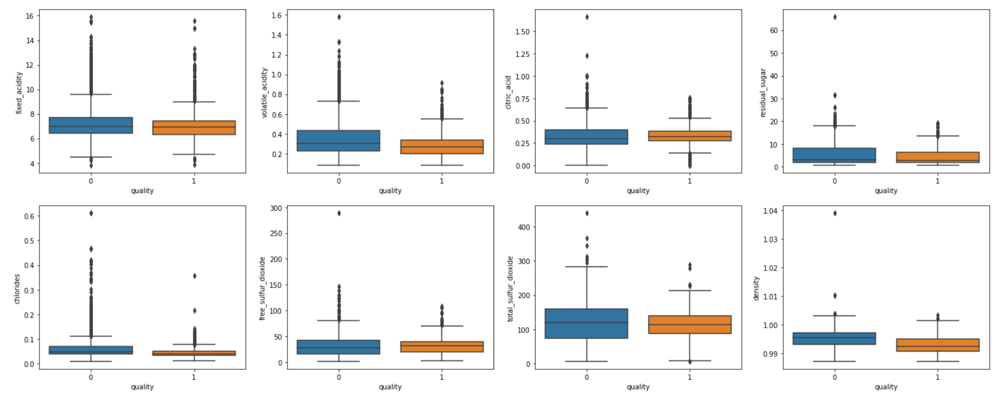
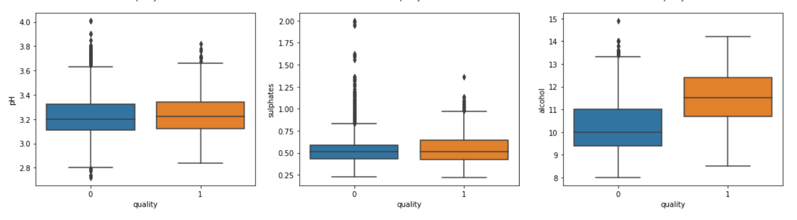
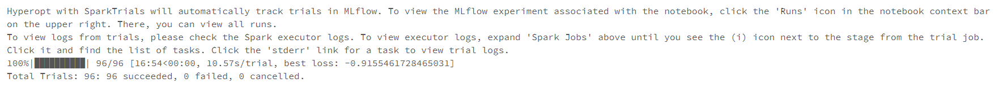
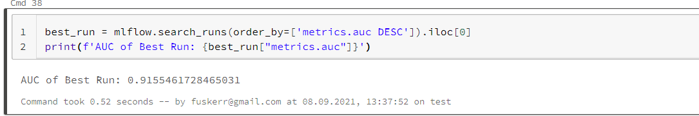
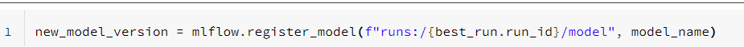
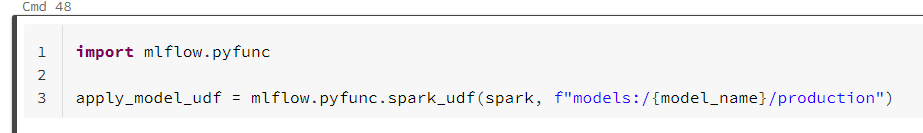
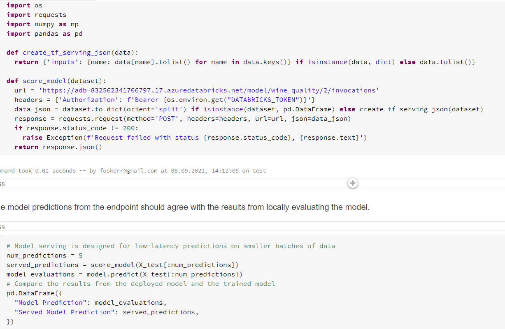
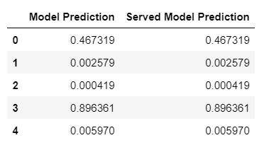

GitHub: https://github.com/ArtemBeltiukov/m08_sparkml_python_azure
* Deploy infrastructure with terraform
```
terraform init
terraform plan -out terraform.plan
terraform apply terraform.plan
....
terraform destroy
```
* Copy notebook and data into Databricks cluster
* Execute all the steps from "ML End-to-End Example" notebook

Import data from your local machine into the Databricks File System (DBFS)

Visualize the data using Seaborn and matplotlib



Run a parallel hyperparameter sweep to train machine learning models on the dataset


Explore the results of the hyperparameter sweep with MLflow

Register the best performing model in MLflow


Apply the registered model to another dataset using a Spark UDF


Set up model serving for low-latency requests



